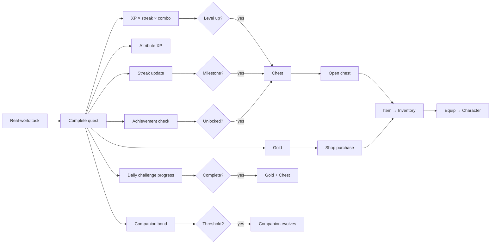
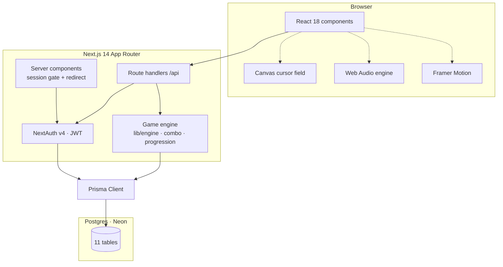
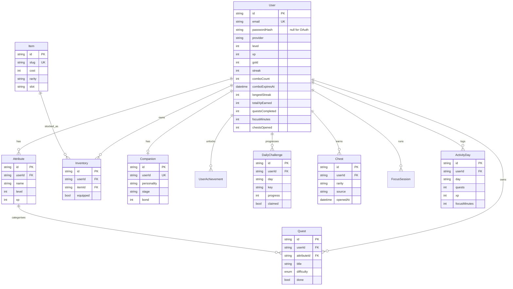
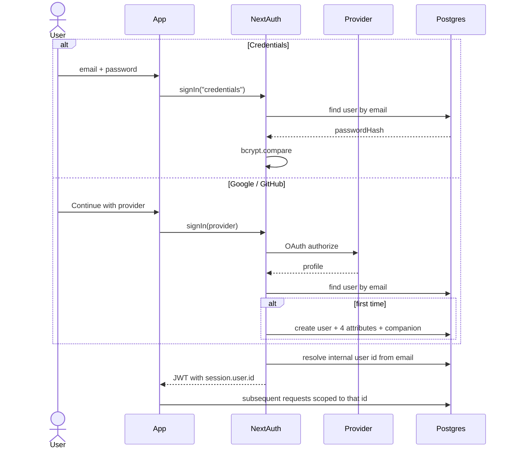
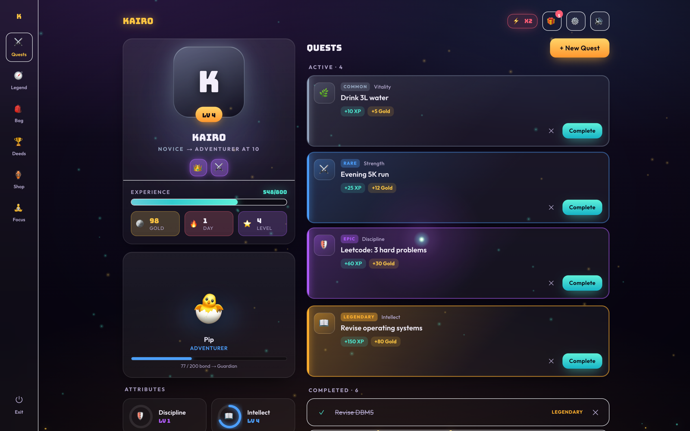
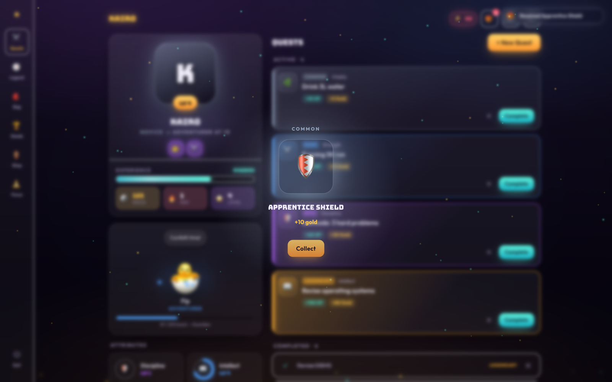
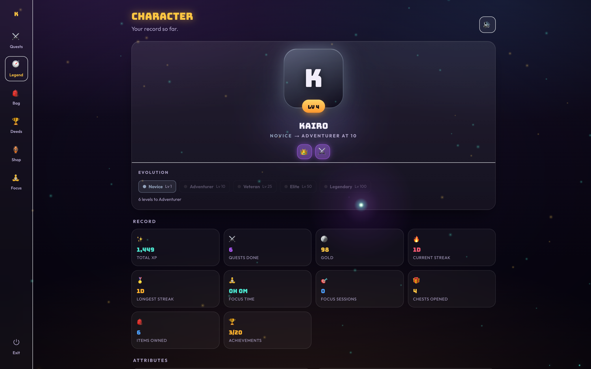
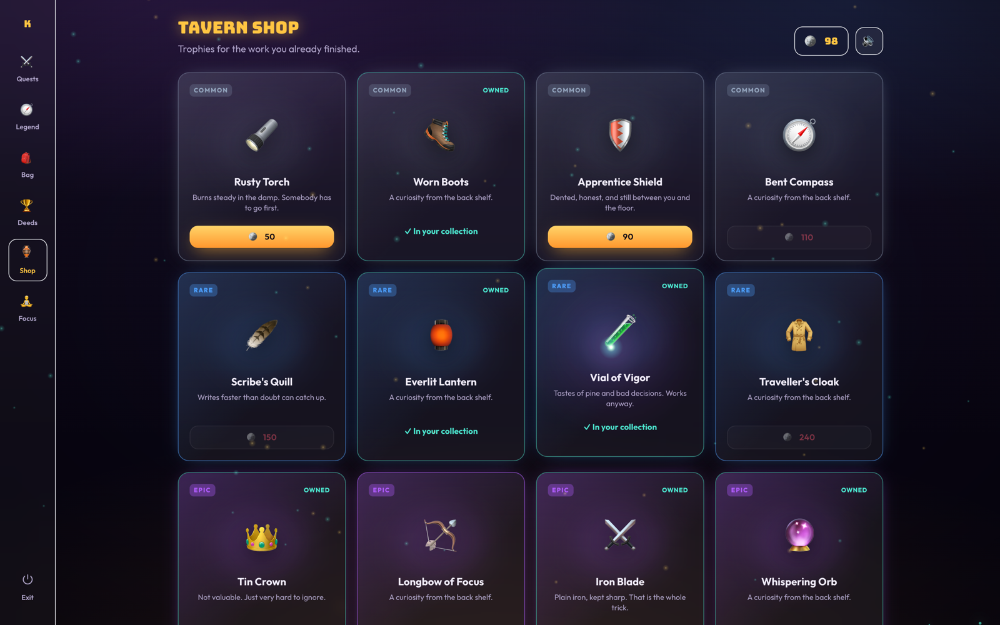
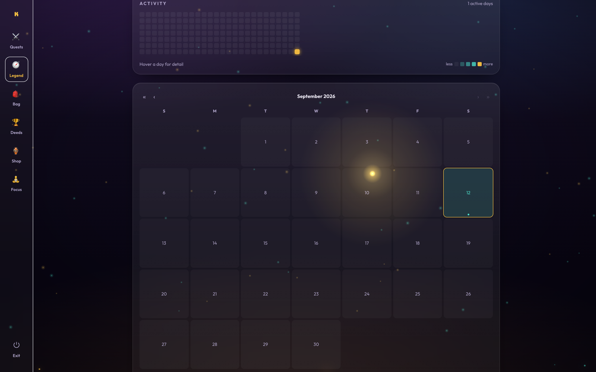
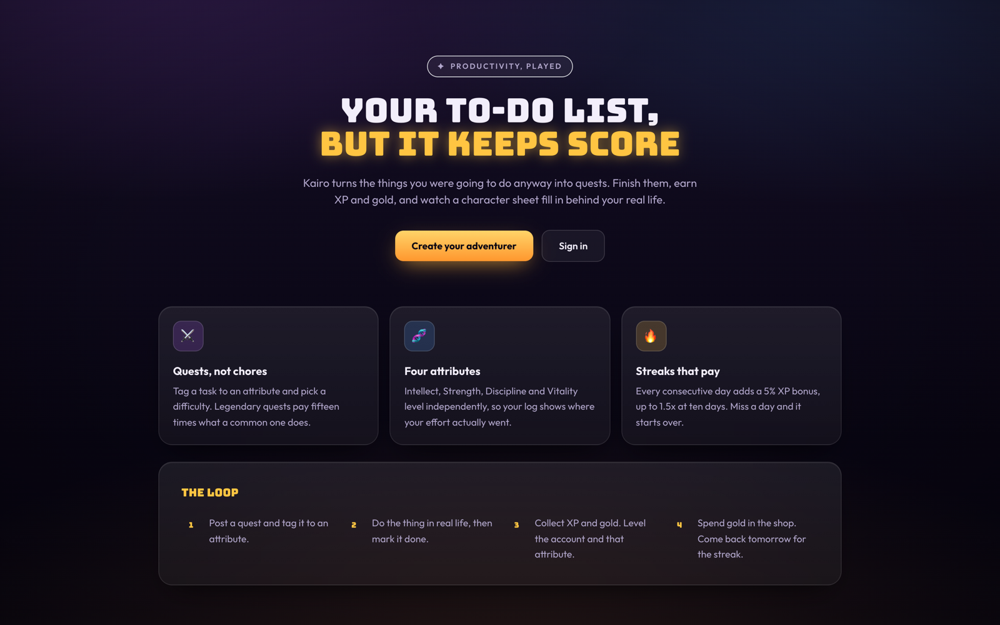

<div align="center">

# Kairo

**Your to-do list, but it keeps score.**

A productivity tracker built as a game. Real tasks become quests that pay out XP, gold, attribute progress, streaks, chests and companion growth — all computed server-side.

[](https://nextjs.org)
[](https://www.typescriptlang.org)
[](https://www.prisma.io)
[](https://neon.tech)
[](https://next-auth.js.org)
[](https://tailwindcss.com)
[](https://kairo-olive-beta.vercel.app)

**[Live App](https://kairo-olive-beta.vercel.app)** · **[Demo Video](#)**

</div>

---

## Try it

### **[kairo-olive-beta.vercel.app](https://kairo-olive-beta.vercel.app)**

Hit **Try the demo** on the landing page and you're straight in — no signup, nothing to type. It hands you a real account already at level 4, with quests to finish, chests to open and a companion of its own, and clears itself up after a day.

To keep progress instead, sign up with any email and password — there's no verification step, so a throwaway address is fine. Google and GitHub sign-in work too.

Pick a companion on the way in. It becomes your character, and it reacts to everything you do from then on.

**The whole loop takes about a minute:**

| | Do this | What to watch |
|---|---|---|
| 1 | Press `N`, name a real task, pick **Legendary** | Difficulty sets the payout — 10 XP for Common, 150 for Legendary |
| 2 | Complete it | XP and gold fly to the counters in the header; the companion reacts |
| 3 | Complete two more, quickly | The combo multiplier climbs — completions inside 30 minutes stack up to ×3 |
| 4 | Open a chest from the header | Level-ups, streaks, achievements and challenges all drop them |
| 5 | Press `B` and equip what you won | It appears on your character straight away |
| 6 | Press `F`, open **Focus sounds**, layer rain and fireplace | Elapsed time is checked on the server, so the reward is real |

Press `C` for the Legend screen — totals, activity heatmap and calendar. Press `H` for every shortcut.

> Rewards are calculated server-side. The completion endpoint takes no request body at all, so nothing can be forged from the browser — see [Reward integrity](#reward-integrity).

---

## The problem

Habit and to-do apps fail for a structural reason: finishing a task returns nothing. A checkbox greys out and the loop ends there. There is no compounding reward, no reason to come back tomorrow, and no visible record of where effort actually went.

## The solution

Kairo makes task completion the input to a progression system. One completed quest triggers a chain:

```
quest completed
  → XP (scaled by streak × combo)   → level up
  → gold                            → shop purchases
  → attribute progress              → attribute level
  → streak                          → streak milestone chest
  → daily challenge progress        → challenge reward + chest
  → achievement progress            → achievement unlock + chest
  → chest                           → item → inventory → equipment → character
  → companion bond                  → companion evolution
```

Every value in that chain is stored in Postgres and calculated on the server. The client sends only a quest ID.

---

## Features

| Area | What it does |
|---|---|
| **Quests** | Create, list and delete. Four difficulty tiers shown as Common / Rare / Epic / Legendary, each tagged to one attribute. Optional time estimate and due date, with overdue quests flagged on the card. |
| **Progression** | `XP_FOR_LEVEL(n) = 100 × n^1.5`. Account and per-attribute levels track separately. |
| **Combo** | Consecutive completions inside a 30-minute window multiply XP: ×1.2 at 2, ×1.5 at 3, ×2 at 5, ×3 at 10. |
| **Streak** | Daily streak with a separate XP bonus of 5% per day, capped at ×1.5. Longest streak retained. |
| **Daily challenges** | Three per day, drawn deterministically per user from a pool of seven. Completion pays gold and drops a chest. |
| **Achievements** | 20 achievements evaluated against real stored counters, with live progress bars for locked ones. |
| **Chests** | Four rarities. Earned from level-ups, streak milestones (3/7/14/30/100 days), achievements and daily challenges. Opening grants an unowned item rolled by rarity, or gold if the pool is exhausted. |
| **Shop** | 16 items across four rarity tiers, with owned/affordable/unaffordable states. |
| **Bag & equipment** | Five slots (Weapon, Armor, Cosmetic, Companion, Trinket), one item each. Equipped gear appears on the character. |
| **Companion** | Six characters to choose from at signup, each drawn as layered SVG so ears, eyes, tail and body animate separately. Five evolution stages driven by bond earned from real activity, five personalities with distinct voice lines, and seven mood states wired to real events. |
| **Character evolution** | Your companion stands as the hero centrepiece and reacts to what happens — posting a quest, completing one, levelling, opening a chest, starting a focus session. Five level tiers — Novice, Adventurer (10), Veteran (25), Elite (50), Legendary (100) — each changing the plinth's colour, aura and orbiting particles. |
| **Focus mode** | 15/25/45-minute sessions. Elapsed time is verified server-side. Rewards scale with minutes focused. |
| **Focus sounds** | Ten layerable ambiences (rain, fireplace, forest, waterfall, ocean, wind, thunder, cafe, night, birds) with per-layer volume. Recordings, level-matched and cross-faded into seamless loops. Mix is persisted. |
| **Stats & history** | Record screen with totals, attribute progress, completions by rarity, streak milestones, a 26-week activity heatmap and a month/year calendar. |
| **Audio** | 24 distinct sound effects synthesised with the Web Audio API, on a separate bus from the focus soundscapes. No background music. |
| **Interactive environment** | Canvas particle field reacting to the pointer — lagging glow with inertia, motion trail, ambient motes pushed aside by the cursor, and reward bursts with shockwave rings. Parallax background layers. |
| **Accessibility** | Keyboard shortcuts, focus-trapped modals, `aria-live` announcements, `role="progressbar"` on every bar, and a reduced-motion mode. |
| **Themes** | Dark and light, each with its own designed palette rather than an inversion. |

---

## Gameplay loop



---

## Architecture



**Request flow for every protected route:** session check → `401` if absent → Zod parse → `400` if invalid → ownership check → `403` if not the owner → transaction → response. Errors always return `{ error: string }` and never leak a stack trace.

### Reward integrity

The completion endpoint accepts **no request body**. Difficulty is read from the database row, so rewards cannot be forged from the client.

The quest is claimed atomically with a guarded `updateMany`, which makes double-completion impossible even under concurrent requests:

```ts
const claimed = await tx.quest.updateMany({
  where: { id: quest.id, done: false },
  data: { done: true, completedAt: new Date() },
});
if (claimed.count === 0) return null; // already completed
```

Only the reward itself runs inside the transaction. Challenges, achievements, chests and companion bond are derived bookkeeping and run after the commit, so a slow database cannot cost a player their XP.

---

## Database



Ownership is enforced by `userId` on every table, with compound uniques (`[userId, name]`, `[userId, itemId]`, `[userId, day, key]`) preventing duplicates and indexes on the hot read paths.

---

## Authentication



Three sign-in methods: email/password, Google and GitHub. Sessions are JWT-based with no database adapter, so OAuth accounts are provisioned in the `signIn` callback — creating the user together with their four starting attributes and companion, identical to a credentials signup.

Because there is no adapter, an OAuth provider returns *its own* user id rather than the application's primary key. The JWT callback therefore always resolves the internal id from the email, which is the stable link to the stored row for both providers.

**Security measures**

- Passwords hashed with bcrypt (10 rounds); `passwordHash` is nullable so OAuth accounts hold no password, and credentials login rejects passwordless accounts
- Every mutating route verifies `row.userId === session.user.id` before writing
- All input validated with Zod; titles are trimmed and length-capped
- Reward maths is server-only — the client cannot submit XP, gold, level or difficulty
- OAuth providers are registered only when both of their environment variables are set, so the app runs without them

---

## Tech stack

| Layer | Choice |
|---|---|
| Framework | Next.js 14.2 (App Router), React 18, TypeScript 5 |
| Database | PostgreSQL on Neon |
| ORM | Prisma 6.19 |
| Auth | NextAuth 4.24 — Credentials, Google, GitHub (JWT sessions) |
| Styling | Tailwind CSS 3.4, CSS custom properties for theming |
| Animation | Framer Motion 13, Canvas 2D for the particle field |
| Audio | Web Audio API — synthesised SFX, recorded focus soundscapes |
| Validation | Zod 4 |
| Hashing | bcryptjs |
| Hosting | Vercel |

**No image or icon assets are shipped.** Every sound effect is generated at runtime from oscillators and filtered noise, and the particle field is drawn to a single canvas using a pre-rendered glow sprite with additive blending.

The ten focus soundscapes are recordings, in `public/ambient` (9.6 MB total). They are mastered to a common level and fetched only when a soundscape is first switched on. Each one has a synthesised equivalent that plays if its file is missing or fails to decode.

Source recordings are from [Pixabay](https://pixabay.com/sound-effects/) under the Pixabay Content License, trimmed and level-matched for looping.

---

## API

| Method | Route | Purpose |
|---|---|---|
| `POST` | `/api/auth/register` | Create account with four attributes and a companion |
| — | `/api/auth/[...nextauth]` | Credentials, Google, GitHub |
| `GET` | `/api/state` | Whole dashboard in one request |
| `GET` | `/api/character` | Character, attributes, inventory |
| `GET` `POST` | `/api/quests` | List / create |
| `DELETE` | `/api/quests/:id` | Delete |
| `POST` | `/api/quests/:id/complete` | Completion cascade (no body) |
| `GET` | `/api/challenges` | Today's challenges with progress |
| `GET` | `/api/achievements` | All 20 with progress and unlock state |
| `GET` | `/api/chests` · `POST /api/chests/:id/open` | List / open |
| `GET` `PATCH` | `/api/inventory` | List / equip |
| `GET` `PATCH` | `/api/companion` | Read / rename, change personality, interact |
| `GET` `POST` `PATCH` `DELETE` | `/api/focus` | Session lifecycle |
| `GET` | `/api/shop` · `POST /api/shop/:slug/buy` | Browse / purchase |
| `GET` | `/api/stats` | Totals plus a year of activity |
| `GET` | `/api/health` | Deployment diagnostics |

Status codes in use: `201`, `400`, `401`, `403`, `404`, `409`, `500`, `503`.

---

## Getting started

**Requirements:** Node 18+, a PostgreSQL database (local or Neon).

```bash
git clone https://github.com/me-adityaraj8/kairo.git
cd kairo
npm install

cp .env.example .env      # then fill it in, see below

npx prisma db push        # create tables
npx prisma db seed        # 16 shop items across four rarities
npm run dev               # http://localhost:3000
```

### Environment variables

| Variable | Required | Purpose |
|---|---|---|
| `DATABASE_URL` | yes | Postgres connection string (pooled on Neon) |
| `DIRECT_URL` | yes | Direct connection, used for schema pushes |
| `NEXTAUTH_SECRET` | yes | Session signing — `openssl rand -base64 32` |
| `NEXTAUTH_URL` | yes | `http://localhost:3000` locally, deployed origin in production |
| `GOOGLE_CLIENT_ID` / `GOOGLE_CLIENT_SECRET` | no | Enables the Google button |
| `GITHUB_CLIENT_ID` / `GITHUB_CLIENT_SECRET` | no | Enables the GitHub button |

Each OAuth button appears only when both of its variables are set.

**OAuth callback URLs**

```
http://localhost:3000/api/auth/callback/google
http://localhost:3000/api/auth/callback/github
https://<your-domain>/api/auth/callback/google
https://<your-domain>/api/auth/callback/github
```

### Scripts

| Command | Effect |
|---|---|
| `npm run dev` | Development server |
| `npm run build` | Production build (runs `prisma generate` first) |
| `npm start` | Serve the production build |
| `npm run lint` | ESLint |
| `npx prisma db seed` | Seed shop items |
| `npx tsx prisma/reset.ts` | Delete all players, keep shop items |

---

## Project structure

```
kairo/
├── app/
│   ├── page.tsx                 # landing (static, SEO surface)
│   ├── login/  register/        # auth screens
│   ├── app/                     # game routes (noindex)
│   │   ├── page.tsx             # quest log + HUD
│   │   ├── character/           # stats, evolution, heatmap, calendar
│   │   ├── bag/                 # inventory + equipment
│   │   ├── achievements/        # hall of deeds
│   │   ├── shop/                # tavern shop
│   │   └── layout.tsx           # settings, audio, cursor providers
│   └── api/                     # 18 route handlers
├── components/game/             # 32 game components
├── lib/
│   ├── engine.ts                # XP curve, rewards, streak
│   ├── combo.ts                 # combo window and multipliers
│   ├── progression.ts           # post-commit cascade
│   ├── achievements.ts          # 20 definitions
│   ├── challenges.ts            # daily pool
│   ├── chests.ts  rarity.ts     # rarity and reward tables
│   ├── companion.ts  evolution.ts
│   ├── audio.ts  ambient.ts     # SFX bus, soundscape mixer
│   ├── characters.ts            # the six companions
│   ├── cursorField.ts           # canvas particle engine
│   └── auth.ts  prisma.ts  session.ts
├── public/ambient/              # 10 focus soundscape loops
└── prisma/
    ├── schema.prisma            # 11 models
    ├── seed.ts                  # shop items
    └── reset.ts                 # dev utility
```

---

## Performance & accessibility

Lighthouse on the landing page:

| Metric | Score |
|---|---|
| Accessibility | 100 |
| SEO | 100 |
| Best Practices | 96–100 |
| Performance | 89–98 (varies with local machine load) |

- Landing page is statically rendered; Framer Motion, audio and the cursor field are scoped to the game routes so they never load on `/`
- Game routes are `noindex`; `sitemap.xml`, `robots.txt` and JSON-LD `WebApplication` are generated
- Fonts self-hosted through `next/font` — no layout shift
- Animation is transform/opacity only, particles run on one canvas with a pre-rendered sprite
- No horizontal overflow at 375 px or desktop widths
- `prefers-reduced-motion` is honoured, and there is an in-app reduced-motion toggle
- Focus rings on every control, focus-trapped modals with `Escape` and focus return, `aria-live` for reward announcements

**Keyboard shortcuts:** `N` new quest · `Q` quests · `S` shop · `A` achievements · `C` character · `B` bag · `F` focus · `G` open chest · `,` settings · `H` help · `Esc` close. Shortcuts are ignored while typing.

---

## Testing

Verified manually against the deployed instance and a local database:

- **Progression** — XP curve, streak multiplier and combo escalation checked against expected values across consecutive completions
- **Cascade** — one completion confirmed to unlock achievements, advance daily challenges and grant chests
- **Chests** — opening grants an unowned item by rarity and writes it to inventory
- **Equipment** — equip and unequip persist, one item per slot
- **Authorisation** — a second account cannot complete, delete or attach quests to the first account's data (`403`); unknown ids return `404`; double-completion returns `409`
- **Validation** — empty or whitespace titles, short passwords and duplicate emails rejected with `400`/`409`
- **Auth** — credentials and GitHub OAuth both provision four attributes and a companion
- **Persistence** — state survives reload and re-login
- **Responsive** — no horizontal overflow at 375 px or 1440 px

Type checking (`tsc --noEmit`) and linting run clean.

---

## Screenshots

### Quest log & HUD
Character with equipped gear, companion, XP bar, gold, streak and combo — beside four active quests showing all rarity tiers with their reward previews.



### Reward chest
Opening a chest reveals the rolled item and its rarity, then writes it to the bag.



| Character & progression | Tavern shop |
|---|---|
|  |  |
| Evolution ladder, record stats and attributes | Four rarity tiers with owned / affordable / unaffordable states |

| Activity | Landing |
|---|---|
|  |  |
| 26-week heatmap and month/year calendar | Static landing page |

## License

[MIT](LICENSE)
